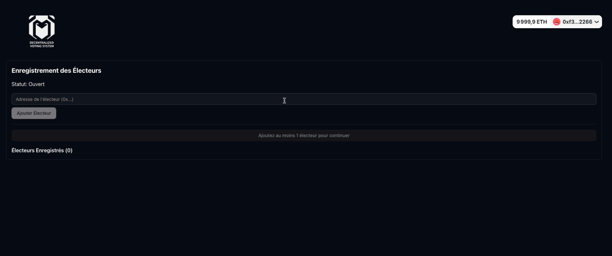
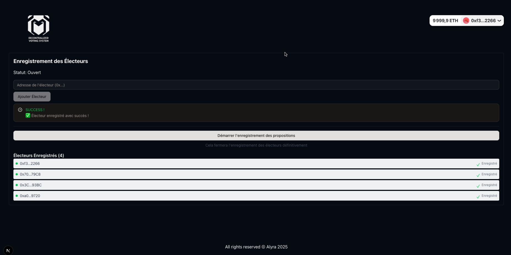
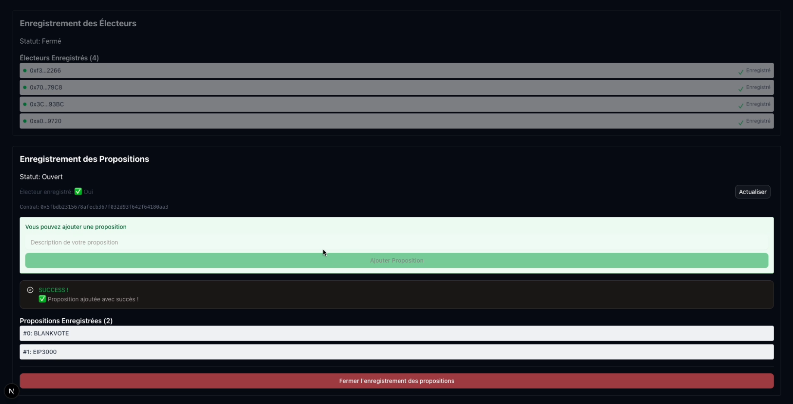
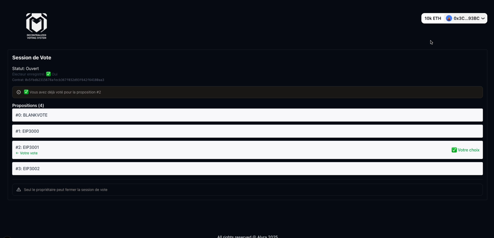
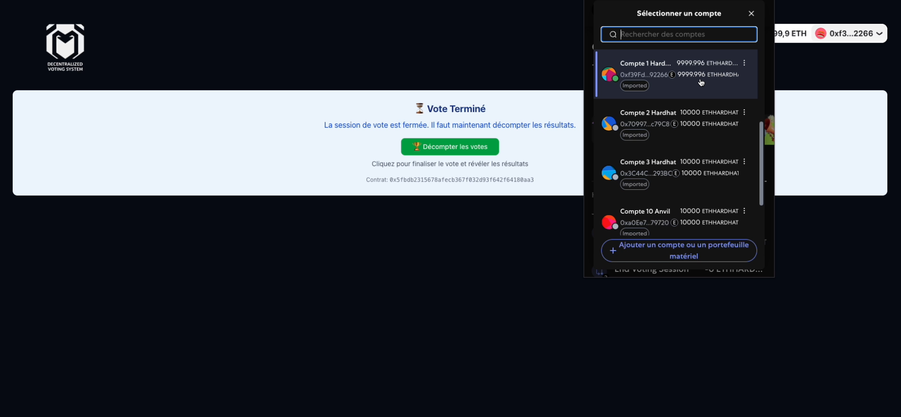
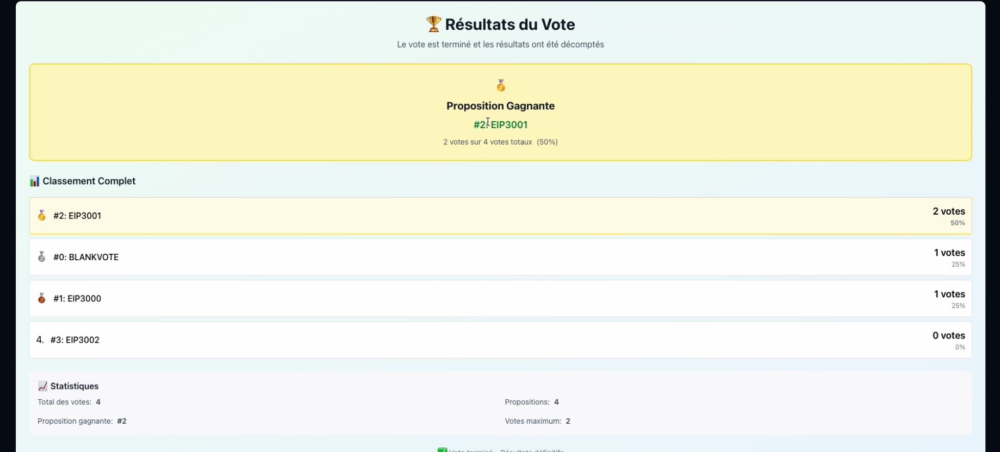
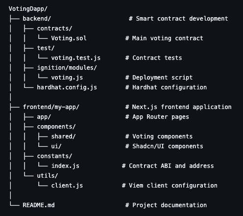

# 🗳️ Decentralized Voting System (DApp)

A complete decentralized voting application built on Ethereum, featuring a robust smart contract backend and an intuitive React frontend.

## 🌐 Live Demo

🚀 Try the DApp

📜 View Smart Contract

## 📸 Screenshots

### 🔗 Wallet Connection & Voter Registration

The application features seamless wallet integration with RainbowKit, allowing users to connect multiple wallet types.

### 💡 Proposal Submission Phase

Registered voters can submit their proposals during the dedicated registration phase.

### 🗳️ Voting Interface

Clean and intuitive voting interface with real-time feedback and proposal visualization.

### 🏆 Results Display

Comprehensive results page showing winner, complete ranking, and voting statistics.

## ✨ Features

### 🔐 Secure & Decentralized

- Smart contract deployed on Ethereum (Sepolia testnet)
- Immutable voting records on blockchain
- Owner-controlled workflow phases

### 🎯 Complete Voting Workflow

- Phase 0: Voter registration by contract owner
- Phase 1: Proposal submission by registered voters
- Phase 2: Proposal review period
- Phase 3: Active voting session
- Phase 4: Vote tallying preparation
- Phase 5: Results revelation

### 🏗️ Advanced Features

- Blank Vote Support: Democratic abstention option
- Real-time Winner Calculation: Gas-optimized vote counting
- Comprehensive Access Control: Role-based permissions
- Event-driven Architecture: Efficient data synchronization
- Responsive Design: Mobile-friendly interface

### 🛡️ Security Features

- Custom error handling for gas optimization
- Reentrancy protection
- Input validation and sanitization
- Role-based access control (RBAC)

## 🏗️ Architecture

### Smart Contract Layer

Voting.sol (Solidity 0.8.28)
- Access Control (OpenZeppelin Ownable)
- Workflow Management (6 phases)
- Voter Registration System
- Proposal Management
- Vote Counting & Winner Calculation
- Event Emission for Frontend Sync

### Frontend Layer

Next.js 15.3.4 Application
- RainbowKit Integration (Wallet Connection)
- Wagmi Hooks (Blockchain Interaction)
- Viem Client (Ethereum Communication)
- Shadcn/UI Components (Modern UI)
- Tailwind CSS (Responsive Styling)

## 🛠️ Tech Stack

### Blockchain & Smart Contracts

- ***Solidity 0.8.28*** - Smart contract development
- ***Hardhat*** - Development environment, testing, and deployment
- ***OpenZeppelin*** - Security-audited contract libraries

### Frontend & Web3 Integration

- ***Next.js 15.3.4*** - React framework with App Router
- ***React 19.0.0*** - UI library
- ***Wagmi 2.15.6*** - React hooks for Ethereum
- ***Viem 2.31.3*** - TypeScript interface for Ethereum
- ***RainbowKit 2.2.8*** - Wallet connection interface

### UI & Styling

***Tailwind CSS 4.0*** - Utility-first CSS framework
***Shadcn/UI*** - Modern React component library
***Lucide React*** - Beautiful icons

### Development & Deployment

***Vercel*** - Frontend hosting and deployment
***Sepolia Testnet*** - Smart contract deployment

## 🚀 Quick Start

### Prerequisites

- Node.js 18+ and npm
- MetaMask or compatible Ethereum wallet
- Sepolia testnet ETH for testing

### 1️⃣ Clone the Repository

> git clone https://github.com/Joh077/VotingDapp.git

> cd VotingDapp

### 2️⃣ Install Dependencies

#### Backend Setup:

> cd backend

> npm install

#### Frontend Setup:

> cd frontend/my-app

> npm install

### 3️⃣ Environment Configuration

#### Backend (.env):

env

SEPOLIA_RPC_URL=your_sepolia_rpc_url
PRIVATE_KEY=your_private_key
ETHERSCAN_API_KEY=your_etherscan_api_key

#### Frontend (constants/index.js):

javascript 

export const contractAddress = "0xF87f63D55e5ED614b91E176Dda9FF6eeFe5a59B1";
export const contractAbi = [...]; 
// ABI from contract compilation

### 4️⃣ Deploy Smart Contract (Optional)

> cd backend

> npx hardhat compile

> npx hardhat ignition deploy ignition/modules/voting.js --network sepolia --verify

### 5️⃣ Run the Application

> cd frontend/my-app

> npm run dev

Visit http://localhost:3000 and connect your wallet to start voting!

## 📖 Usage Guide

### For Contract Owner

1. ***Deploy Contract***: Deploy using Hardhat to your preferred network
2. ***Register Voters***: Add eligible voter addresses in Phase 0
3. ***Start Proposal Phase***: Transition to Phase 1 for proposal submission
4. ***Close Proposals***: Move to Phase 2 after sufficient proposals
5. ***Start Voting***: Begin the voting session (Phase 3)
6. ***End Voting***: Close voting and move to Phase 4
7. ***Tally Votes***: Execute final tally to reveal results (Phase 5)

### For Voters

1. ***Connect Wallet***: Use RainbowKit to connect your Ethereum wallet
2. ***Check Registration***: Verify your address is registered by the owner
3. ***Submit Proposals***: Add your proposals during Phase 1
4. ***Cast Vote***: Vote for your preferred proposal during Phase 3
5. ***View Results***: Check the final results and statistics after tallying

### Voting Options

- ***Regular Proposals***: Vote for community-submitted proposals
- ***Blank Vote***: Choose abstention if no proposal appeals to you
- ***One Vote Per Address***: Each registered voter gets exactly one vote

## 🔧 Smart Contract Details

### Contract Address (Sepolia)

0xF87f63D55e5ED614b91E176Dda9FF6eeFe5a59B1

### Key Functions

| Function           | Access        | Description           |
| ------------------ | ------------- | ------------          |
| addVoter(address)  | Owner         | Register a new voter  |
| addVoter(address)  | Voters        | Submit a proposal     |
| addVoter(address)  | Voters        | Cast a vote           |
| addVoter(address)  | Owner         | Finalize results      |

### Events

- VoterRegistered(address) - New voter registered
- ProposalRegistered(uint) - New proposal added
- Voted(address, uint) - Vote cast
- WorkflowStatusChange(uint, uint) - Phase transition

### Gas Optimizations

- Pre-calculated storage addresses for voter data
- Real-time winner calculation (no loops in tallyVotes)
- Custom errors instead of strings
- Efficient event emission

## 🧪 Testing

### Run Smart Contract Tests

>cd backend

>npx hardhat test

### Test Coverage Areas

- Workflow phase transitions
- Voter registration and validation
- Proposal submission and retrieval
- Vote casting and validation
- Winner calculation accuracy
- Access control enforcement

## 🚀 Deployment

### Smart Contract Deployment

> npx hardhat compile

> npx hardhat ignition deploy ignition/modules/voting.js --network sepolia --verify

> npx hardhat ignition verify chain-11155111

## Frontend Deployment

The frontend is automatically deployed to Vercel on every push to the main branch.

### Manual Deployment:

> cd frontend/my-app

> npm run build

> vercel --prod

## 📁 Project Structure

## 👨‍💻 Author

***Johan L***

- GitHub: @Joh077
- Project: VotingDapp

